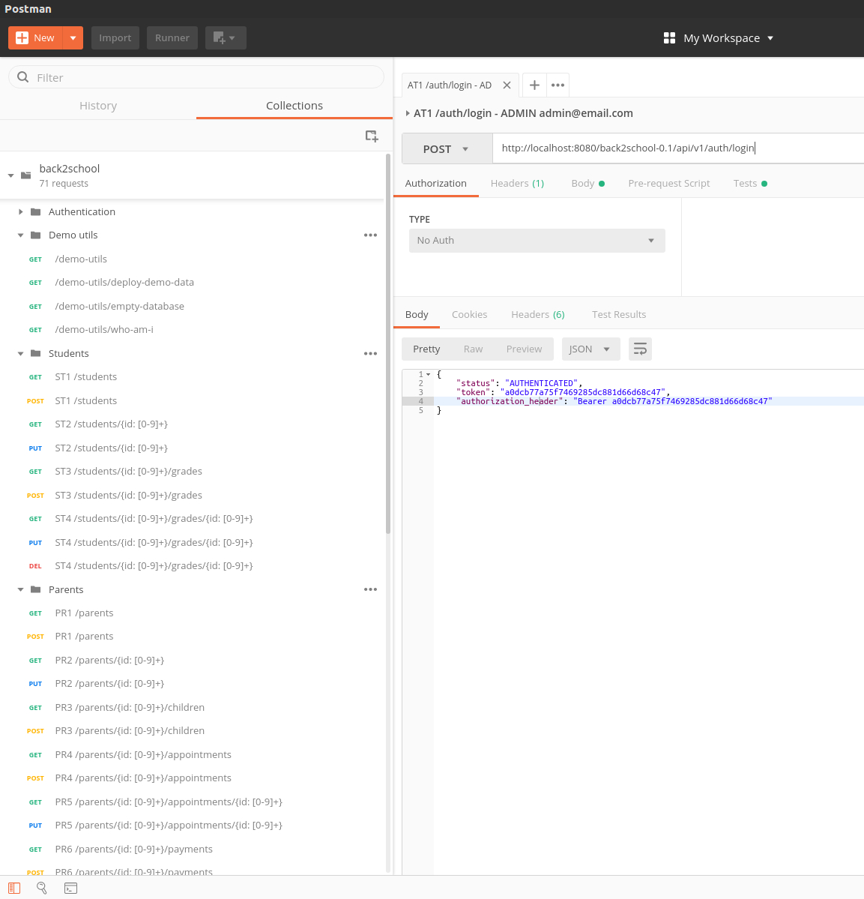
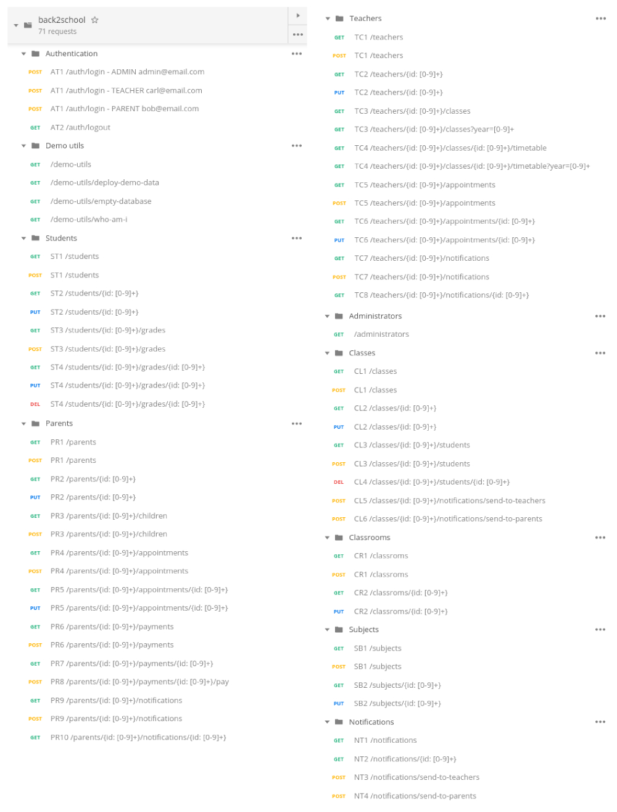

# Postman APIs interaction and demo data deployment

We created a set of predefined API calls, as a [Postman collection], to ease the interaction with the REST APIs.

The exported version of the Postman collection created is the `back2school.postman_collection.json` file at the repository root.

### Import Postman collection

In order to exploit the already created HTTP requests, import the collection from: File -> Import...

### Authentication 

All the APIs require an *Authorization header* through which the server recognize the authenticated user.

In the imported collection, the header is already set up in all requests and it exploits a Postman global variable to access the authentication token. The token is obtained by the client as a response on a successful `/auth/login` invocation. Each time, a login request succeed, a *test-script* does set a Postman global variable (`back2school_token`). This global variable is accessed by all the other requests of the back2school collection in order to always use an up to date token.
To see how the *test-script* works, have a look at the *Test* tab on any of the login requests of the "Authentication" folder.

*Extracted from Tests tab of `/auth/login`*
```JavaScript
/* --------- SET back2school_token GLOBAL VARIABLE ----------- 
After a login request, set the global variable back2school_token in Postman ecosystem.
This variable is used in the Authorization of the folders containing endpoints which requires authentication.
Look at the folders configuration (at the right of folder name:  ...) to inspect the variable usage. 

Look at logout request for the variable unsetting.
*/
if (responseBody) {
    var jsonData = JSON.parse(responseBody);
    if (jsonData.status == "AUTHENTICATED") {
        pm.globals.set("back2school_token", jsonData.token);
    }
}
```

*Extracted from Tests tab of `/auth/logout`*
```JavaScript
/* --------- UNSET back2school_token GLOBAL VARIABLE ----------- 
After a logout request, unset the global variable back2school_token in Postman ecosystem.
This variable is used in the Authorization of the folders containing endpoints which requires authentication.
Look at the folders configuration (at the right of folder name:  ...) to inspect the variable usage. 

Look at login request for the variable setting.
*/
if (responseBody) {
    var jsonData = JSON.parse(responseBody);
    if (jsonData.status == "LOGGED_OUT") {
        pm.globals.unset("back2school_token");
    }
}
```

### Demo utils

The demo utils folder contains some useful API for demo purposes.

- `/demo-utils` list the available demo endpoints 
- `/demo-utils/deploy-demo-data` load some predefined data into the database
- `/demo-utils/empty-database` does empty the database
- `/demo-utils/who-am-i` returns who is the authenticated user


### Example of Postman API invocation 



### List of available API requests




[Postman collection]: https://www.getpostman.com/collection
